## Online Marketplace
---
### Fuctionalities 
* First user has to add new product by clicking the New Product Icon.
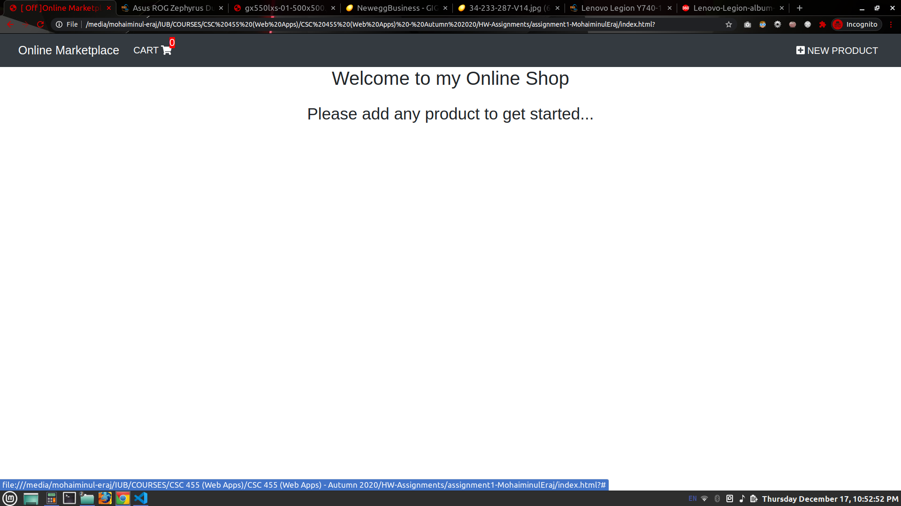

* Then a pop up will appear where user have to put the information of the product which will be stored in the localStorage.
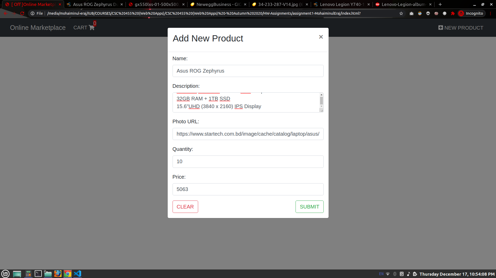

* This is how it will look like after user add his/her first product.
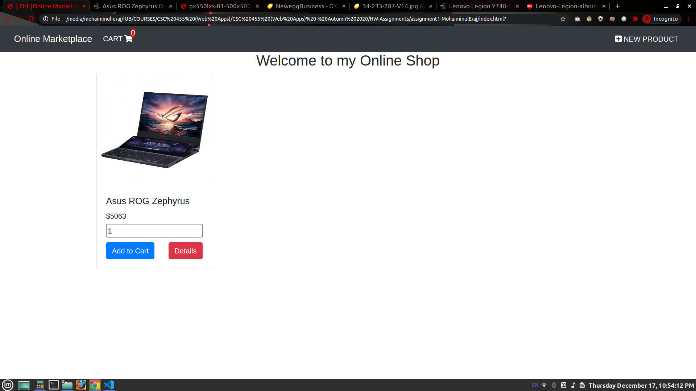

* A sample preview of how the page will look like after adding multiple products in the localStorage.
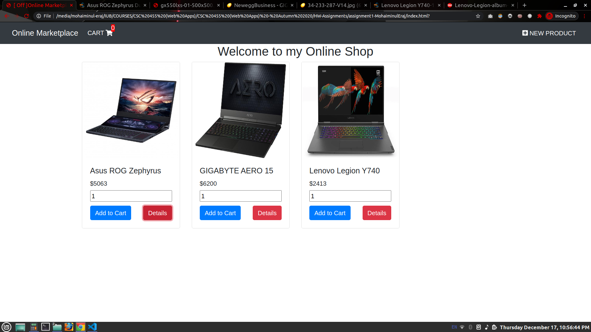

* If the product available in the stock are limited and user tries to add more items than it's available in the stock then this alert message will pop up saying how many products are available in the stock. As you can see that I'm trying to add 14 Lenovo Legion Y740 Laptop but only 8 of them are available in the stock.
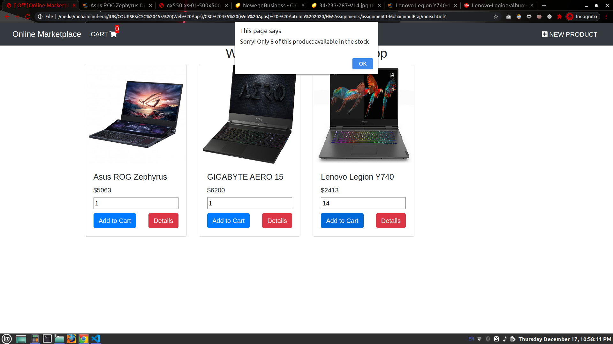

* By clicking the Details button of the product this window will show up. Here you can see that Details of the product, name, availability, price and user can also add/increase the quantity of that product.
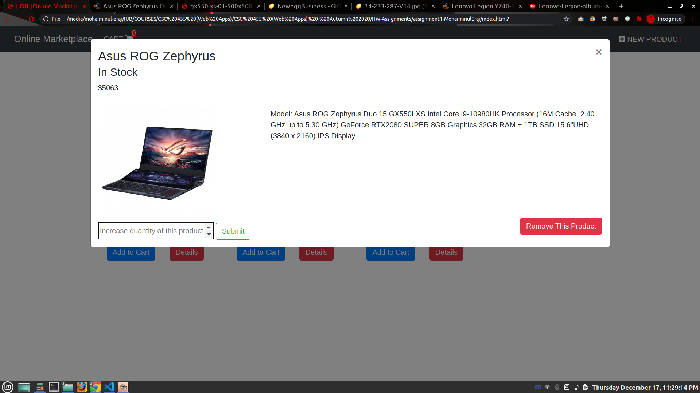

* By clicking the Remove this Product button from the previous image. That product will be fully removed from the stock and cartlist if it's added to the cart.
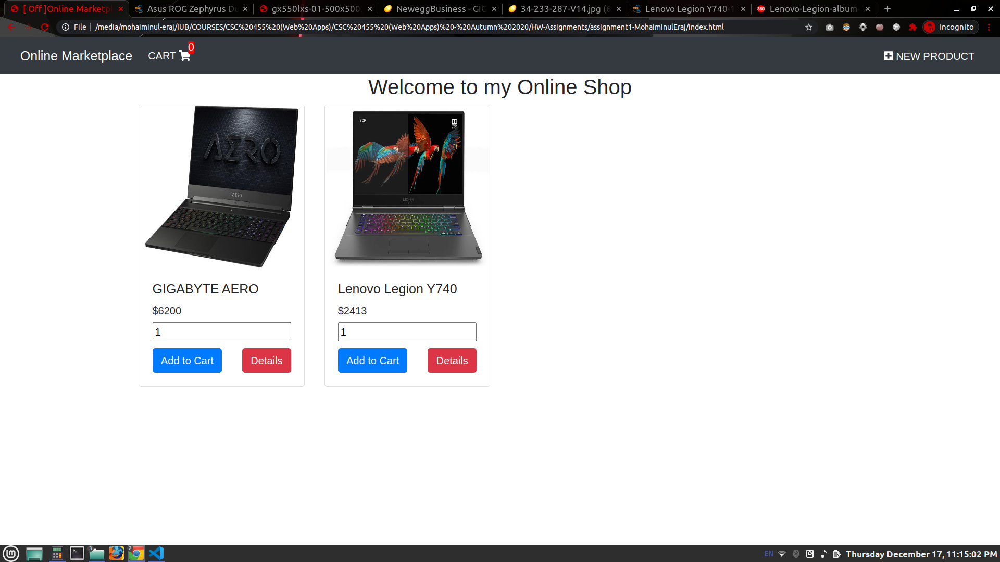

* User can add as many item as they want in the cart as long as the product is available in the stock. The CART will get updated every time user click the Add to Cart button.
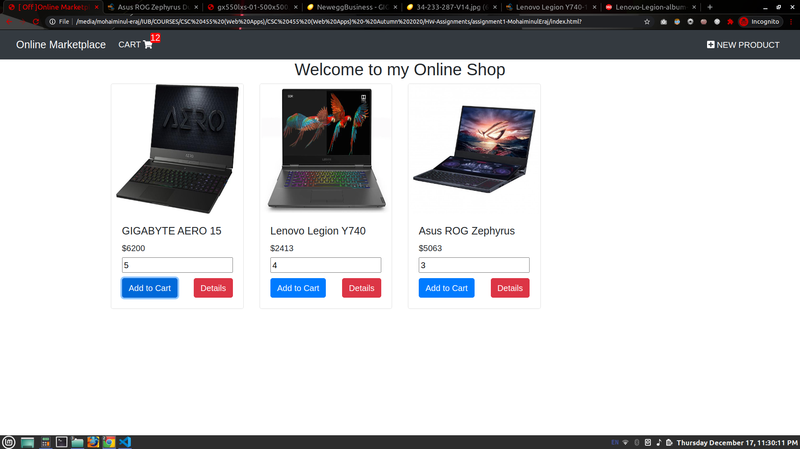

* After clicking the CART icon this page will appear where user can see how many items are available in the stock,total price, quantity of the product that user added to their cart list. User can also increase/decrease the item from the cartlist by editing the numbers in the QUANTITY then clicking that UPDATE button. user can also remove item from the cartlist by clicking REMOVE button.
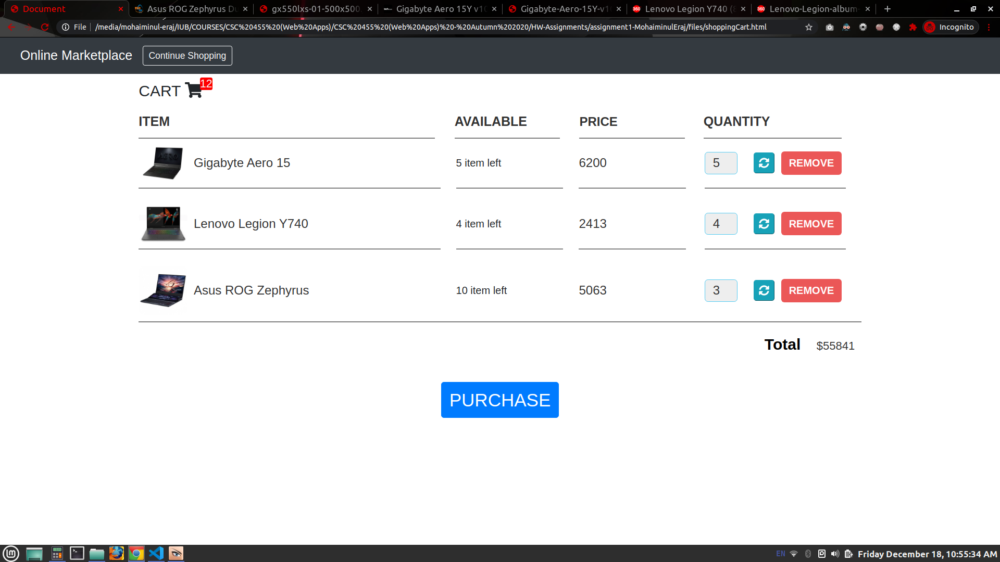

* After increasing/decreasing the item from the cartlist user have to click on the UPDATE button.

* By clicking the REMOVE button user can remove the product from their shopping list. And the cart & total amount will autometically get updated.
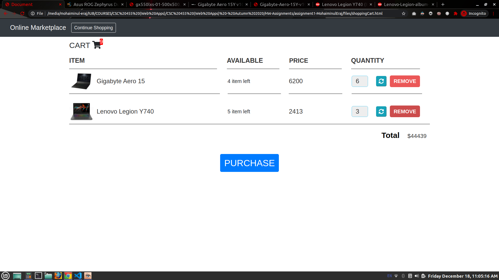

* After clicking the PURCHASE button this alert message will appear. and by clicking OK user can complete their checkout.
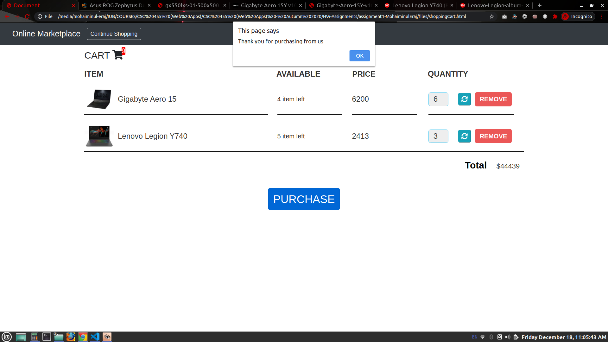

* This is the final look of the cartlist. After user gets done with the checkout.
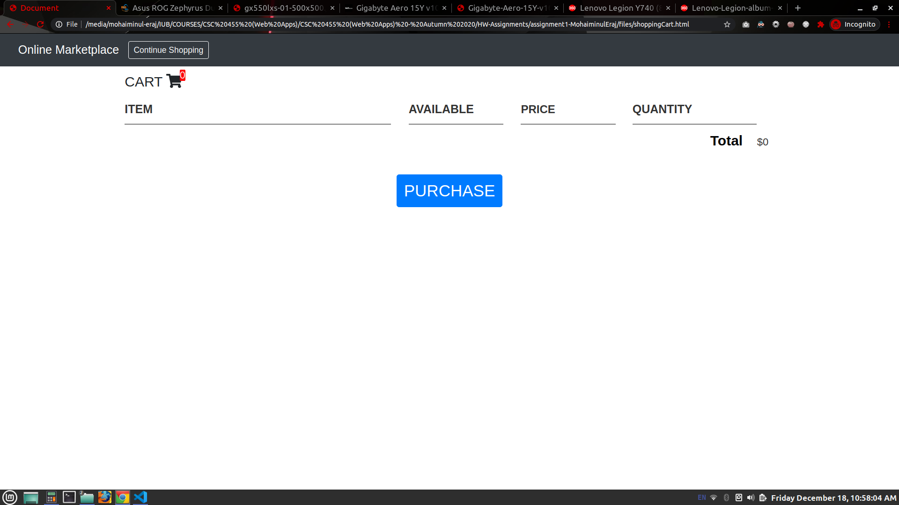